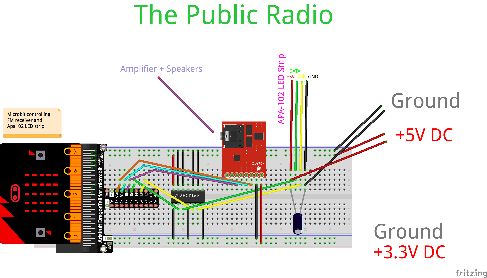

Current Build:
Microbit controlling FM Receiver and APA102 LED light string:

Use Microbit with the Arduino IDE
https://learn.adafruit.com/use-micro-bit-with-arduino/overview

Setup MakeCode build
- Install node.js https://nodejs.org/en/
- Follow instructions at:
https://github.com/Microsoft/pxt-microbit

- Create a new package and then submit for approval for it to appear at
- https://makecode.com/packages/getting-started/vscode
- https://makecode.microbit.org/packages/build-your-own
- https://makecode.com/simshim

https://makecode.microbit.org/
https://support.microbit.org/support/solutions/articles/19000054952-package-approval
